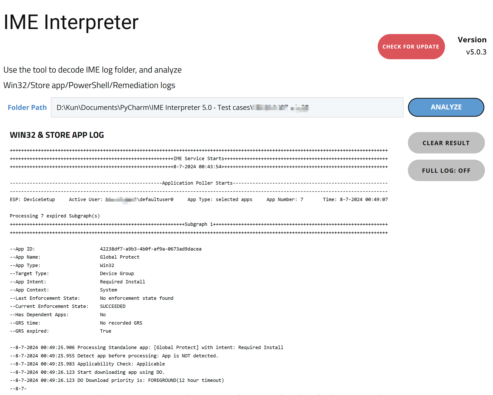

# Intune-IME-Project
IME tool to analyze IntuneManagementExtension.log

# How to use:
Download and unzip IME Interpreter V5.0.zip from release/
There are 3 programs:
1. IME Interpreter V5.0.exe: Main program with debug window for general use.
2. update.exe: Updater program which is used to update *.py and *.json files from GitHub src folder. Whenever there is a hotpatch, run this program and it can be updated right away.

## Command line argument format:

Normal log output(igonoring non expired Subgraphs):

"IME Interpreter V5.0.exe" "path_to_ime_log_folder" "path_to_output_file"

Full log output:

"IME Interpreter V5.0.exe" "path_to_ime_log_folder" "path_to_output_file" FULL

## Tool screenshots:

## Currently supported scenarios:

1. App poller meta: EspPhase, user session, Comgt app workload status, required/available/selected apps mode, app number after filter
2. Required App processing flow
3. Available App processing flow
4. App Uninstallation flow
5. Not Applicable
6. Dependent App processing flow
7. DO download priority
8. GRS skip flow
9. Incomplete Application Poller/Win32 app processing flow
10. MSFB UWP app flow

## Roadmap

1. PowerShell script diagnosis
2. Proactive remediation diagnosis
3. Win32 supersedence flow
